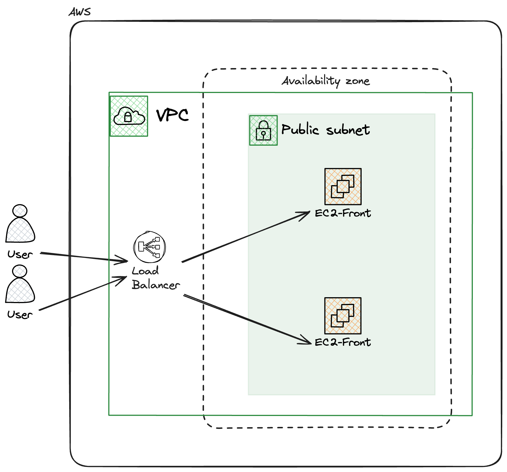

# Proyecto Terraform en AWS

Este proyecto utiliza Terraform para desplegar una infraestructura básica en AWS, que incluye una VPC, subredes, instancias EC2 con Apache y un balanceador de carga.

## Arquitectura

 <br>

## Características

- Crea una VPC con subredes públicas y privadas.
- Despliega instancias EC2 que ejecutan Apache.
- Configura un balanceador de carga para distribuir el tráfico.

## Requisitos previos

- [Terraform](https://www.terraform.io/downloads.html) instalado.
- [AWS CLI](https://aws.amazon.com/cli/) configurado con credenciales válidas.

## Cómo usar

1. Clona el repositorio.
2. Define las variables de entrada en un archivo `terraform.tfvars`.
3. Ejecuta los siguientes comandos:
   ```bash
   terraform init    # Inicializa el directorio
   terraform plan     # Muestra el plan de ejecución
   terraform apply    # Crea la infraestructura
   ```

## Limpieza

Para destruir la infraestructura, ejecuta:

```bash
 terraform destroy
```

Esto eliminará todos los recursos creados.
