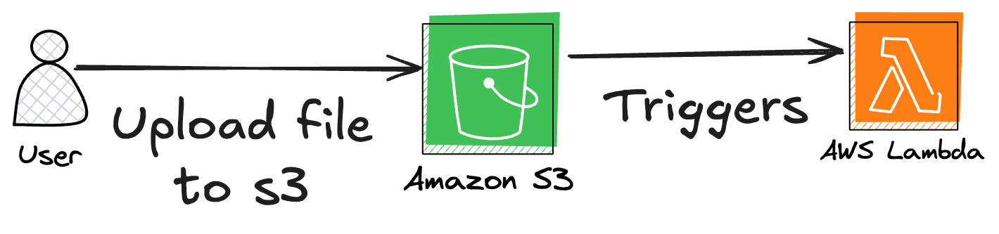

# AWS Lambda Function Triggered by S3

## Overview

This project provisions an **AWS Lambda function** that is triggered whenever a file is uploaded to an **S3 bucket**. The function reads the metadata of the uploaded file and logs its content type to **Amazon CloudWatch Logs**.

## Arquitecture

 <br>

## How It Works

1. **S3 Bucket Creation:**

   - A new **Amazon S3** bucket named `lambda-function-45` is created.
   - The function code is stored in this bucket before deployment.

2. **IAM Role and Permissions:**

   - The Lambda function is assigned an **IAM Role** with:
     - Read-only access to S3 (`AmazonS3ReadOnlyAccess`).
     - Permissions to write logs to **Amazon CloudWatch Logs**.

3. **AWS Lambda Deployment:**

   - A **Lambda function** (`function-type-archive45`) is created using **Python 3.12**.
   - The function's source code is stored in the S3 bucket and referenced in Terraform.

4. **S3 Event Trigger:**
   - The **S3 bucket** is configured to trigger the **Lambda function** whenever a new object is uploaded.
   - The Lambda function extracts the uploaded file’s metadata and logs the content type.

## Advantages of AWS Lambda (Serverless)

- **No Server Management:** AWS Lambda eliminates the need to provision or manage servers.
- **Automatic Scaling:** The function scales automatically based on the number of file uploads.
- **Cost Efficiency:** Charges are based on execution time, making it a cost-effective solution.
- **Seamless Integration:** Easily integrates with other AWS services like **S3, CloudWatch, and IAM**.

## Deployment Instructions

1. **Ensure you have Terraform installed** (`terraform -v`).
2. **Initialize the Terraform project:**
   ```sh
   terraform init
   ```
3. **Update the `source` path in the Terraform code to match the location of `lambda_function.zip` on your local machine.**

   - Open the Terraform file where the `aws_s3_object` resource is defined.
   - Modify the `source` attribute to point to the correct file path on your system.
   - Example:
     ```hcl
     source = "/path/to/your/lambda_function.zip"  # Change this to your actual local path
     ```

4. **Deploy the infrastructure:**
   ```sh
   terraform apply -auto-approve
   ```
5. **Upload a file to the S3 bucket (`lambda-function-45`).**
6. **Check CloudWatch Logs** to see the content type of the uploaded file.
