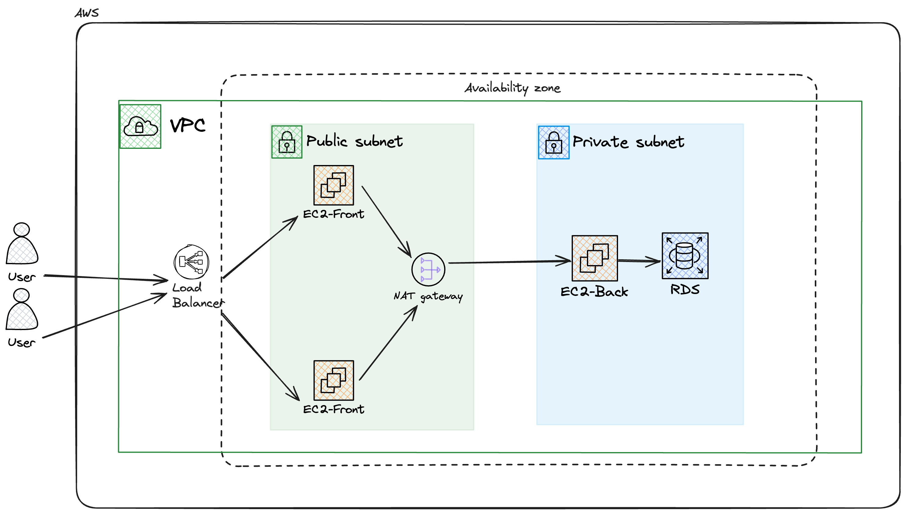

# Proyecto Terraform en AWS

Este proyecto utiliza Terraform para automatizar la creación de una infraestructura en AWS, diseñada para soportar una aplicación duplicada de otro repositorio que incluye un frontend, backend y una base de datos MySQL. La configuración cubre aspectos clave de la infraestructura, como redes, seguridad, load balancer y almacenamiento.

## Arquitectura

  

## Características principales

- **Proveedor AWS**: Configuración de la región de AWS mediante variables.
- **VPC y Subredes**: Creación de una Virtual Private Cloud (VPC) con subredes públicas y privadas distribuidas en múltiples zonas de disponibilidad para asegurar redundancia.
- **Internet Gateway y NAT Gateway**: Gestión del tráfico de red tanto público como privado.
- **Instancias EC2**: Despliegue de instancias EC2 para los componentes frontend y backend con configuraciones específicas de red y seguridad.
- **Base de datos MySQL**: Implementación de una instancia de RDS para la base de datos, utilizando grupos de subredes para mayor flexibilidad y seguridad.
- **Load balancer**: Uso de un Application Load Balancer (ALB) para distribuir el tráfico entre las instancias frontend.
- **Seguridad**: Configuración de Grupos de Seguridad para controlar el acceso a las instancias y a la base de datos.

## Requisitos previos

- Terraform instalado en tu máquina local.
- AWS CLI configurado con credenciales válidas.
- Llave SSH configurada en AWS para el acceso a las instancias EC2.

## Variables de entrada

El proyecto utiliza variables para personalizar aspectos como:

- La región de AWS.
- Los rangos de CIDR para la VPC y las subredes.
- El tipo y configuración de las instancias EC2.
- Las credenciales y parámetros de la base de datos.

## Estructura del Proyecto

El proyecto está organizado en los siguientes componentes:

- **Red y Subredes**: Configuración de una VPC, subredes públicas y privadas.
- **Instancias EC2**: Despliegue de servidores para el frontend y backend.
- **Base de datos RDS**: Creación de una instancia MySQL con subredes privadas.
- **Balanceo de carga**: Configuración de un Application Load Balancer.
- **Seguridad**: Grupos de seguridad para controlar el tráfico de red.

## Cómo usar

1. Clonar el repositorio.
2. Definir las variables de entrada necesarias.
3. Ejecutar los comandos de Terraform para inicializar, planificar y aplicar la infraestructura.
